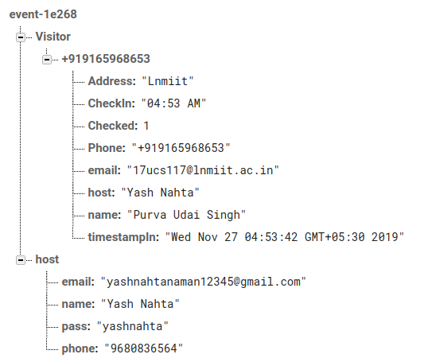
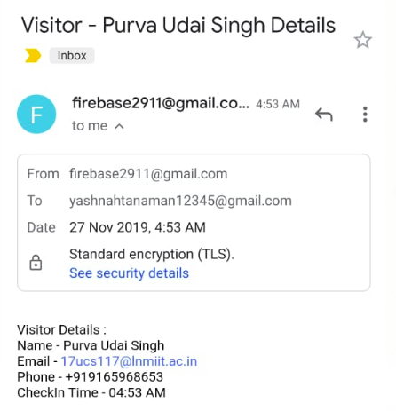
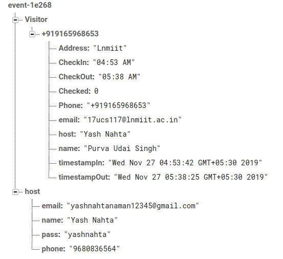
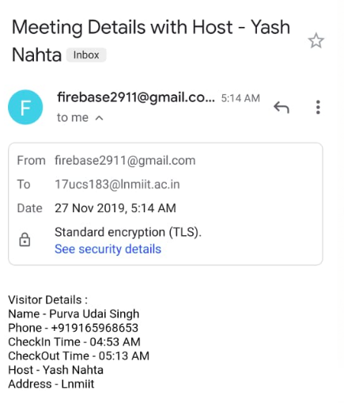

# Entry Management
Entry Mnagement Software for Innovacer SDE Assignment

# Prerequisites
Min Sdk version supported is 16. The app has been tested on Android Phone running Android Pie.

# How It Works
# Check In-
When the user enters his details and checks in,the details are saved in Firebase Database-

Also message is sent to the host using the phones Messaging app Carrier Network-

E-Mail is sent using JavaMail API in Android -[Port of JavaMail API](https://code.google.com/archive/p/javamail-android/)
We also need to Define a JSSE(Java Security Socket Extension) Provider.
Since our email sender is specialized for GMail, mailhost is hard coded. So, constructor takes only username and password to authenticate to SMTP server. In constructor, we define all the Properties used during the Session for which we get a default instance.

# Check Out-
When the user enters his details and checks out,the details are saved in Firebase Database-

Also an E-mail is sent to Host after user Checks out of the meeting-

# Host
Host Details can be changed in 2 ways-
*Directly without any Validation.
*Check for the password of the previous Host.
Depending on the requirements we can use any of the above.

# Tech Stack-
**Android using Java and Xml**

# Setup-
To install the app either open source code in **Android Studio** and build to run the app or install it directly with the [Apk File](link)

