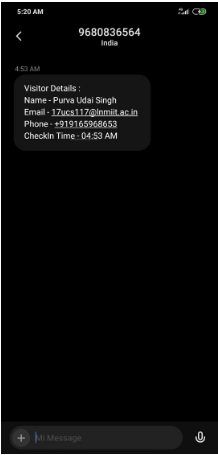
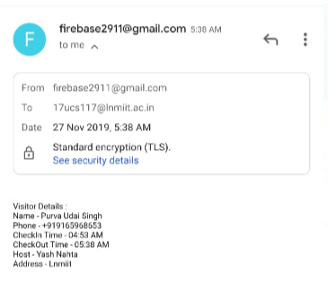
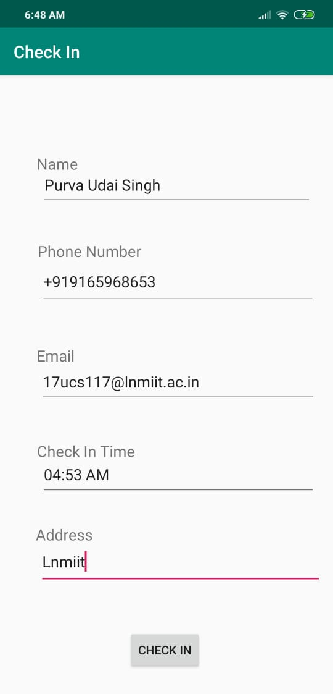
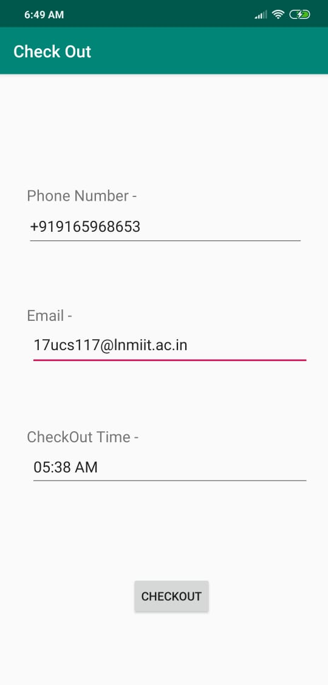
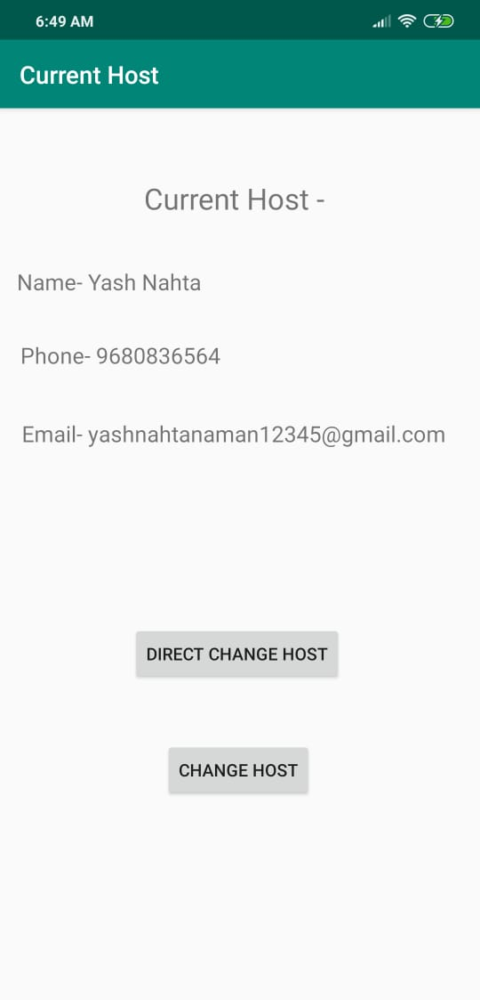
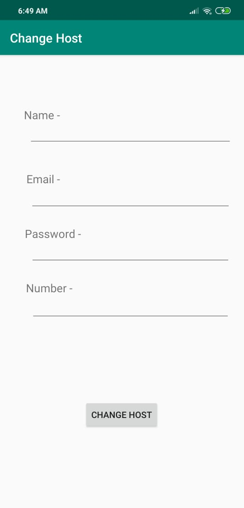
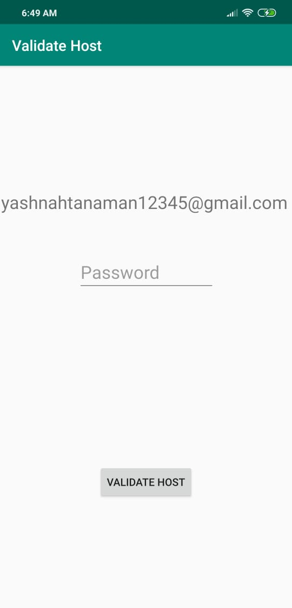

# Entry Management

Entry Mnagement Software for Innovaccer SDE Assignment

## Support Version

Min Sdk version supported is 16. The app has been tested on Android Phone running Android Pie.

## Setup

To install the app either open source code in **Android Studio** and build to run the app or install it directly with the **[Apk File](https://drive.google.com/open?id=1PUNinAsr_B9krhzVt66ubLZn8Uf_tHN1)**

Firebase Login credentials-

Email-firebase2911@gmail.com

Password-yashnahta291

## How It Works

The workflow is divided in 3 parts -

### 1.Check In-

When the user enters his details and checks in,the details are saved in **Firebase Database-**

Also **message** is sent to the **host** using the phones Messaging app Carrier Network-

**E-Mail** is sent using JavaMail API in Android -[Port of JavaMail API](https://code.google.com/archive/p/javamail-android/)
We also need to Define a **JSSE**(Java Security Socket Extension) Provider.
Since our email sender is specialized for GMail, mailhost is hard coded. So, constructor takes only username and password to authenticate to SMTP server. In constructor, we define all the Properties used during the Session for which we get a default instance.
**E-mail** is sent to the **Host-**

### 2.Check Out-

When the user enters his details and checks out,the details are saved in **Firebase Database-**

Also an **E-mail** is sent to Visitor after user Checks out of the meeting-

### 3.Host-

**Host** Details can be changed in 2 ways-

1.Directly without any Validation.

2.Check for the password of the previous Host.

Depending on the requirements we can use any of the above.

## Tech Stack-
**Android Studio**
- **Java**
- **Xml**
- **Firebase**

## App ScreenShots-

**HomeScreen**

**Check In**

**Check Out**

**Current Host**

**Change Host**

**Validate Host**

